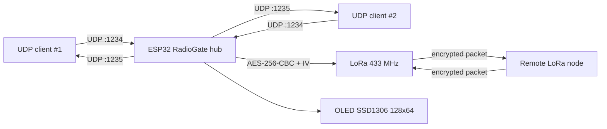
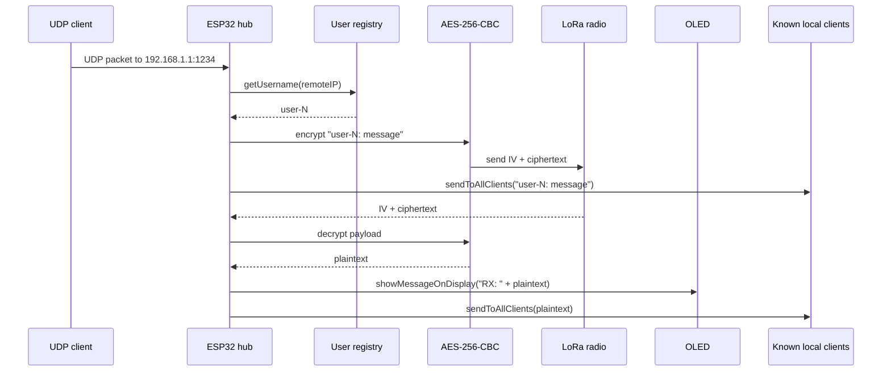

# RadioGate

ESP32-проект, который работает как мост между локальными UDP-клиентами по Wi-Fi и LoRa-радиоканалом. В репозитории находится один Arduino-скетч: [`sketch_apr14a.ino`](./sketch_apr14a.ino).

## 🎯 Идея проекта

### Что делает проект

Прошивка поднимает на ESP32 собственную Wi-Fi access point сеть, принимает текстовые сообщения по UDP, подписывает их именем локального клиента, шифрует через AES-256 и отправляет по LoRa. В обратную сторону она принимает LoRa-пакеты, расшифровывает их, показывает на OLED-дисплее и рассылает всем обнаруженным локальным UDP-клиентам.

### Для чего он нужен

Проект нужен как компактный радио-шлюз, который:

- дает локальным устройствам точку входа в LoRa-сеть без прямой работы с LoRa-модулем;
- объединяет Wi-Fi и LoRa в одном ESP32-узле;
- позволяет быстро собрать локальный хаб для обмена короткими сообщениями.

### Какую проблему решает

Код решает задачу переноса простого текстового обмена между двумя средами связи:

- локальная сеть устройств, подключенных к ESP32 по Wi-Fi;
- удаленные узлы, доступные только через LoRa.

Иными словами, ESP32 берет на себя роль промежуточного транспорта: UDP с локальной стороны и LoRa с радио-стороны.

## 📦 Что есть в репозитории

На момент анализа репозиторий содержит только один исходный файл:

| Файл | Назначение |
| --- | --- |
| `sketch_apr14a.ino` | Полная прошивка хаба: Wi-Fi AP, UDP, шифрование AES, работа с LoRa и OLED |

В репозитории **нет**:

- отдельного мобильного или desktop-клиента;
- прошивки удаленного LoRa-узла;
- схемы подключения;
- `platformio.ini`, `arduino-cli.yaml`, `library.json` или другого build-конфига;
- тестов и CI-конфигурации.

## 🧱 Архитектура

Несмотря на один файл, код логически разбит на несколько подсистем.

| Компонент | Где находится | Роль |
| --- | --- | --- |
| Wi-Fi AP конфигурация | `ssid`, `password`, `apIP`, `subnet` | Поднимает локальную сеть ESP32 в режиме access point |
| UDP транспорт | `udpRecv`, `udpSend`, `UDP_RECV_PORT`, `UDP_SEND_PORT` | Принимает сообщения от клиентов и отправляет сообщения обратно локальным клиентам |
| Конфигурация LoRa | `LORA_*`, `LoRa.begin(433E6)` | Настраивает SPI-пины и радио на частоту 433 МГц |
| AES шифрование | `aes_key_str`, `encryptAndSendLoRa()` | Шифрует исходящие сообщения перед отправкой в LoRa |
| Реестр пользователей | `UserEntry`, `users`, `getUsername()` | Назначает IP-адресам имена вида `user-1`, `user-2`, ... |
| Буфер OLED | `displayLines`, `pushDisplayLine()`, `showMessageOnDisplay()` | Хранит и отрисовывает короткий лог на SSD1306 |
| Инициализация | `setup()` | Запускает OLED, Wi-Fi AP, UDP и LoRa |
| Основной цикл | `loop()` | Последовательно обрабатывает два направления: `UDP -> LoRa` и `LoRa -> UDP` |

### Как компоненты взаимодействуют

1. Локальный клиент подключается к Wi-Fi сети ESP32.
2. Клиент отправляет UDP-сообщение на хаб.
3. Хаб определяет IP отправителя и либо находит для него существующее имя, либо создает новое.
4. Хаб формирует строку вида `user-N: <message>`.
5. Эта строка шифруется и уходит в LoRa.
6. Та же строка рассылается всем уже известным локальным клиентам.
7. При приходе LoRa-пакета хаб расшифровывает его, показывает на OLED и отправляет локальным клиентам.

### Поток выполнения

#### Startup flow

1. `setup()` запускает `Serial` и инициализирует генератор случайных чисел.
2. Инициализируется OLED-дисплей и выводится стартовый статус.
3. ESP32 переходит в режим `WIFI_AP`, поднимает сеть и начинает слушать UDP-порт приема.
4. Инициализируется SPI и LoRa-модуль.
5. При успешном старте LoRa на дисплей добавляется строка `LoRa OK`.

#### Runtime flow

1. В `loop()` сначала опрашивается UDP-сокет.
2. Если есть UDP-пакет, он читается, получает префикс имени пользователя и пересылается:
   - в LoRa после AES-шифрования;
   - всем известным локальным клиентам через UDP.
3. Затем опрашивается LoRa.
4. Если пришел LoRa-пакет, из него читается IV и шифртекст, данные расшифровываются.
5. Если после расшифровки строка не пустая, она:
   - выводится на OLED с префиксом `RX: `;
   - рассылается всем известным локальным клиентам.

## 🗺️ Диаграмма архитектуры



`Remote LoRa node` на диаграмме показан как внешний участник системы. Его реализация в репозитории отсутствует.

## 🔄 Flow работы



## ⚙️ Конфигурация по умолчанию

Все параметры захардкожены в скетче.

| Параметр | Значение из кода | Комментарий |
| --- | --- | --- |
| Wi-Fi SSID | `LoRa-Hub-1` | Точка доступа, которую поднимает ESP32 |
| Wi-Fi пароль | `12345678` | Минимальный пароль для AP |
| IP хаба | `192.168.1.1` | Используется как адрес access point |
| Подсеть | `255.255.255.0` | Сеть `/24` |
| UDP прием | `1234` | На этот порт локальный клиент должен отправлять сообщения |
| UDP рассылка клиентам | `1235` | На этом порту локальный клиент должен принимать сообщения |
| LoRa частота | `433E6` | Радиочастота 433 МГц |
| Максимум известных локальных пользователей | `10` | Ограничение массива `users[10]` |
| OLED | `SSD1306`, `128x64`, `0x3C` | I2C-дисплей |
| AES ключ | `aes_key_str` | 32-байтовый ключ, зашитый в исходник |

### Пины LoRa

| Сигнал | GPIO |
| --- | --- |
| `LORA_SCK` | `5` |
| `LORA_MISO` | `19` |
| `LORA_MOSI` | `27` |
| `LORA_SS` | `18` |
| `LORA_RST` | `23` |
| `LORA_DIO0` | `26` |

Для OLED в коде используется `Wire.begin()` без переопределения пинов, то есть ожидаются стандартные для ESP32 I2C-линии `SDA=21`, `SCL=22`.

## 🚀 Как использовать

### Требования

По коду можно уверенно вывести только следующие требования:

- плата на базе ESP32;
- LoRa-модуль, совместимый с библиотекой `LoRa.h` и текущей распиновкой SPI;
- OLED-дисплей SSD1306 `128x64` по I2C;
- Arduino IDE или совместимая среда для прошивки ESP32;
- библиотеки:
  - `LoRa`
  - `Adafruit GFX`
  - `Adafruit SSD1306`

Компоненты `WiFi.h`, `WiFiUdp.h`, `SPI.h`, `Wire.h` и `mbedtls/aes.h` приходят из ESP32 SDK/Arduino core. Точная версия ядра ESP32 в репозитории не зафиксирована.

### Установка

1. Откройте [`sketch_apr14a.ino`](./sketch_apr14a.ino) в Arduino IDE.
2. Установите поддержку плат ESP32, если она еще не установлена.
3. Установите библиотеки `LoRa`, `Adafruit GFX` и `Adafruit SSD1306`.
4. Проверьте, что ваша разводка совпадает с GPIO, указанными в скетче.
5. При необходимости измените сетевые параметры, частоту LoRa и AES-ключ прямо в исходнике.
6. Прошейте скетч в ESP32.

### Запуск

После старта прошивки ожидается следующее поведение:

- ESP32 поднимет Wi-Fi сеть `LoRa-Hub-1`;
- локальный клиент должен подключиться к этой сети;
- отправка сообщений идет на `192.168.1.1:1234`;
- прием обратных сообщений идет на локальном порту `1235`;
- OLED покажет статус запуска и входящие LoRa-сообщения.

### Пример использования

#### Отправка UDP-сообщения на хаб

```python
import socket

sock = socket.socket(socket.AF_INET, socket.SOCK_DGRAM)
sock.sendto(b"hello from laptop", ("192.168.1.1", 1234))
sock.close()
```

После этого хаб:

- присвоит вашему IP имя вроде `user-1`;
- сформирует строку `user-1: hello from laptop`;
- отправит ее по LoRa;
- разошлет ее всем известным локальным клиентам.

#### Прием сообщений от хаба

```python
import socket

sock = socket.socket(socket.AF_INET, socket.SOCK_DGRAM)
sock.bind(("0.0.0.0", 1235))

while True:
    data, addr = sock.recvfrom(2048)
    print(f"{addr}: {data.decode(errors='replace')}")
```

Такой клиент будет получать:

- локальные сообщения, которые хаб ретранслировал после приема по UDP;
- сообщения, пришедшие из LoRa после расшифровки.

## 🔌 API / функции

У проекта нет HTTP API или внешних REST-эндпоинтов. Его внешний интерфейс состоит из:

- UDP-приема на порту `1234`;
- UDP-рассылки на порт `1235` для известных клиентов;
- LoRa-передачи/приема зашифрованных пакетов.

Ключевые функции скетча:

| Функция | Назначение |
| --- | --- |
| `getUsername(IPAddress ip)` | Ищет пользователя по IP, обновляет `lastSeen`, при необходимости создает имя `user-N` |
| `renderDisplay()` | Полностью перерисовывает OLED из буфера строк |
| `clearDisplayBuffer()` | Очищает буфер дисплея и вызывает перерисовку |
| `pushDisplayLine(const String& line)` | Сдвигает буфер из 8 строк вверх и добавляет новую строку в конец |
| `showMessageOnDisplay(const String& msg)` | Разбивает длинное сообщение на части по 21 символ и выводит в буфер дисплея |
| `sendToAllClients(const char* message)` | Шлет UDP-сообщение всем IP-адресам, ранее замеченным в `getUsername()` |
| `encryptAndSendLoRa(const char* plaintext)` | Шифрует строку через AES-CBC, добавляет случайный IV и отправляет через `LoRa` |
| `setup()` | Стартовая инициализация дисплея, Wi-Fi AP, UDP и LoRa |
| `loop()` | Главный рабочий цикл с обработкой направлений `UDP -> LoRa` и `LoRa -> UDP` |

## ✨ Особенности и фишки

На основании текущего кода проект выделяется следующими решениями:

- **Автономный режим работы.** Хаб сам поднимает Wi-Fi access point и не зависит от внешнего роутера.
- **Мост между двумя транспортами.** Один и тот же ESP32 обрабатывает UDP и LoRa в едином цикле.
- **Автоматическое именование клиентов.** Клиентам не нужен логин или регистрация: IP автоматически получает имя `user-N`.
- **Шифрование LoRa-трафика.** Перед отправкой данные шифруются AES-256-CBC, а в пакет добавляется случайный IV.
- **Локальная fan-out рассылка.** Любое принятое сообщение отправляется всем уже известным локальным клиентам, а не только источнику.
- **Встроенный мини-лог на OLED.** На дисплее хранятся 8 строк текста; длинные сообщения режутся на блоки по 21 символу.

## ⚠️ Ограничения, видимые из кода

- Проект пока реализован одним большим `.ino`-файлом без разделения на модули.
- Максимум известных локальных клиентов ограничен 10 записями.
- Ограничение исходного текста перед шифрованием: до 200 символов.
- В репозитории нет прошивки второй стороны LoRa-канала, поэтому протокол виден только со стороны хаба.
- `lastSeen` обновляется, но нигде не используется для очистки устаревших клиентов.
- Сообщения, пришедшие по UDP, логируются в `Serial`, но не выводятся на OLED.
- Все чувствительные параметры захардкожены прямо в исходнике.

## 🔧 Потенциальные улучшения

Ниже не факты о текущем состоянии, а практичные направления развития, которые прямо следуют из устройства кода:

- вынести SSID, пароль, ключ AES, порты и LoRa-параметры в конфигурацию;
- разделить скетч на отдельные модули: `transport`, `crypto`, `display`, `users`, `config`;
- добавить очистку или TTL для пользователей по `lastSeen`;
- зафиксировать формат LoRa-пакета отдельной структурой и версией протокола;
- добавить контроль целостности и аутентификацию пакета, а не только шифрование;
- добавить ACK/retry и защиту от дублирования сообщений;
- предоставить reference-клиент для UDP и прошивку удаленного LoRa-узла;
- добавить схему подключения и зафиксировать поддерживаемые модели плат ESP32/LoRa;
- добавить build-инструкции для `arduino-cli` или `PlatformIO`.

## 📝 Итог

`RadioGate` в текущем виде — это минималистичный, но законченный по основному сценарию ESP32-хаб, который соединяет локальных UDP-клиентов и LoRa-сеть, шифруя радиотрафик и отображая входящие LoRa-сообщения на OLED. Репозиторий хорошо показывает рабочую идею устройства, но пока не содержит окружающей инфраструктуры: клиентских приложений, удаленного узла, схемы и сборочной конфигурации.
